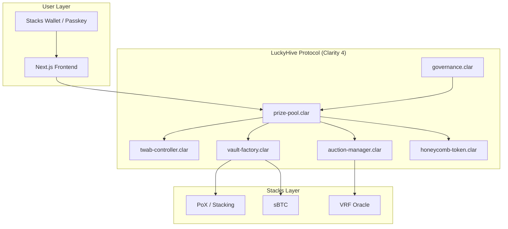

# LuckyHive

LuckyHive is a decentralized, no-loss prize savings protocol built natively on the Stacks blockchain. By combining Bitcoin's fundamental security with Stacks' smart contracts and native yield generation (PoX/sBTC), LuckyHive creates a sustainable, risk-free prize pool game inspired by Prize-Linked Savings (PLS) models like Premium Bonds and PoolTogether.


## Core Mechanics

1. **No-Loss Savings**: Users deposit STX or sBTC into the "Hive" (Prize Pool). Unlike a lottery, users never lose their principal and can withdraw at any time.
2. **Native Yield**: The protocol routes all pooled deposits into Yield Vaults (e.g., Stacks PoX stacking) to generate base yield.
3. **Provably Fair Draws**: Periodically, the accumulated yield from all deposits is pooled together and awarded to a single, randomly selected winner.
4. **Time-Weighted Average Balance (TWAB)**: A user's chance of winning is proportional to their TWAB. The longer you hold your deposit and the larger the amount, the higher your chances. This prevents gamification (depositing right before a draw).

## Architecture

The protocol is built using a modern architecture separating the smart contract layer (Clarity) from the presentation layer (Next.js).

### Data Flow



### Smart Contracts (Clarity 4)

All contracts are written in Clarity 4 and managed via Clarinet.

- `twab-controller.clar`: Time-Weighted Average Balance ring buffer tracking user balances over time.
- `prize-pool.clar`: The central hub that accepts deposits, processes withdrawals, and triggers draws.
- `vault-factory.clar`: Manages routing funds into different yield-generating strategies (like PoX).
- `auction-manager.clar`: Handles the commit-reveal scheme for verifiable randomness and the Dutch auction for prize claims.
- `honeycomb-token.clar`: A SIP-010 fungible token that acts as a receipt for deposits.
- `governance.clar`: Manages protocol parameters with timelocked proposals.
- `auth-provider.clar`: Enables Clarity 4 `secp256r1-verify` passkey authentication support.

### Frontend Application

The frontend is a fully responsive Web3 application built with:

- **Framework**: Next.js 14 (App Router)
- **Styling**: Tailwind CSS with custom glassmorphism and Bitcoin Native brand aesthetics
- **Web3 Integration**: `@stacks/connect` and `@stacks/network`
- **Animations**: Framer Motion for micro-interactions
- **UX Enhancements**: React Hot Toast for non-blocking notifications, skeleton loaders, and intuitive forms

## Project Setup

### Prerequisites

- Node.js 18+
- npm or yarn
- Clarinet (for smart contract testing and deployment)

### Smart Contract Initialization

To test the Clarity contracts:

```bash
cd luckyhive
clarinet test
```

### Frontend Development

To run the Next.js development server:

```bash
cd luckyhive/frontend
npm install
npm run dev
```

The application will be available at `http://localhost:3000`.

## Security

- **No-Loss Guarantee**: The core `prize-pool` contract strictly enforces that users can always withdraw exactly what they deposited.
- **Decidability**: Clarity's non-Turing complete design prevents re-entrancy attacks by default.
- **Timelocks**: All governance parameter changes are subject to a timelock delay.
- **Emergency Pause**: A circuit breaker can halt deposits and draws during critical vulnerabilities (withdrawals remain active).

## License

MIT License. See `LICENSE` for details.
