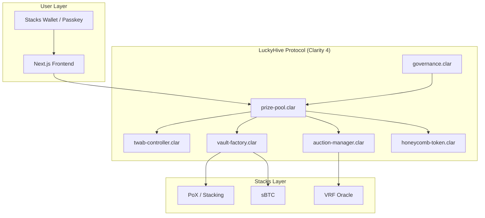

# Lucky Hive

[](https://github.com/luckyhive-protocol/luckyhive-core/actions)
[](https://opensource.org/licenses/MIT)

Lucky Hive is an institutional-grade, gamified no-loss savings primitive designed exclusively for the Stacks blockchain. By leveraging Clarity 4 safety guarantees and the Nakamoto sub-second finality, the protocol seamlessly converts native PoX and (forthcoming) sBTC yields into a verifiable prize pool mechanism.


## High-Level Architecture

The protocol operations are managed across a suite of 7 tightly scoped Clarity smart contracts:

1.  **`prize-pool.clar`**: The primary entry point. Manages user deposits/withdrawals, tracks global liquidity, and coordinates draw execution.
2.  **`twab-controller.clar`**: The accounting engine. A bounded, gas-efficient Time-Weighted Average Balance controller. This contract strictly avoids unbounded loops, a critical differentiation from EVM equivalents.
3.  **`vault-factory.clar`**: The yield generation routing layer. Handles the traits necessary for interacting with Stacking mechanisms and sBTC collateral.
4.  **`auction-manager.clar`**: The randomness execution engine. Currently utilizes a cryptographic commit-reveal schema leveraging Stacks block hashes, architected for future decentralized VRF integration.
5.  **`honeycomb-token.clar`**: A fully `SIP-010` compliant fungible token acting as the protocol's receipt and governance asset.
6.  **`governance.clar`**: Timelocked parameter management for protocol fees and tier distributions.
7.  **`auth-provider.clar`**: Manages `secp256r1-verify` integrations for passkey abstraction.

## Nakamoto Readiness

The protocol is explicitly engineered to maximize the UX improvements of the Nakamoto release:

- **High-Frequency State:** Our "Nectar Drops" (micro-prizes) logic relies heavily on the 5-second block cadence of Nakamoto, enabling near real-time dopamine loops for retail users impossible under the legacy 10-minute Bitcoin block time.
- **Flash Liquidity:** Deposit and withdrawal states are resolved swiftly, utilizing Nakamoto's flash blocks to prevent front-running edge cases during draw periods.

## Security & Verification Guarantees

As a protocol handling user principal, security is paramount. We embrace Clarity's design philosophy:

- **Decidability:** All execution paths are decidable. `twab-controller.clar` achieves fair odds calculation without relying on unpredictable, unbounded iteration loops spanning the entire depositor base.
- **Post-Conditions:** Every state-mutating function natively enforces strict post-conditions, ensuring principal guarantee (a user can _always_ withdraw their exact initial deposit amount).
- **Tooling:** The entire repository passes strict `clarinet check` analysis with zero warnings. We employ exhaustive property-based testing across edge cases involving time-weighted boundary conditions.

### Data Flow



## Project Setup

### Prerequisites

- Node.js 18+
- npm or yarn
- Clarinet (for smart contract testing and deployment)

### Local Development (Clarinet)

To test the Clarity contracts:

```bash
cd luckyhive
clarinet check
clarinet test --coverage
```

### Frontend Development

To run the Next.js development server:

```bash
cd luckyhive/frontend
npm install
npm run dev
```

The application will be available at `http://localhost:3000`.

## License

MIT License. See `LICENSE` for details.
